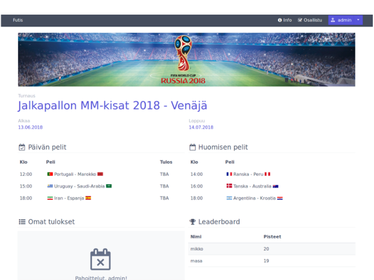

###Futis-app


Futis-app is fantasy football betting platform (for fun, not for money). Challenge your friends and see who has the best knowledge in football or other sports! Participate in ready-made tournaments, guess who will win games and earn points.

If you want to test a live version, you can do it by visiting this [link](https://futis-app-test.herokuapp.com/). Note however that if you create new account, admin has to accept your registeration.
You can use test account with username: "testuser", and password: "testpass".

**Please note:** this project is not ready and is under construction.

## Tecnologies

This app is developed with Node and Express in the backend, paired with Knex handling database queries and Pug for generating views. Used database is PostgreSQL and styling is done with Spectre.css.

## Installation

1. Clone the repository.
2. Run ```'npm install'.```
3. Set up your database and add setup '.env' file with your configuration.
4. Navigate to 'database'-folder.
5. To get your database to right state run ```'knex migrate:latest'.```
6. To get data your database run ```'knex seed:run'```
7. Start application ```'npm start'```

## Contributors

This project is maintained and created by:
[@matsba](https://github.com/matsba)
[@okkimus](https://github.com/okkimus)

